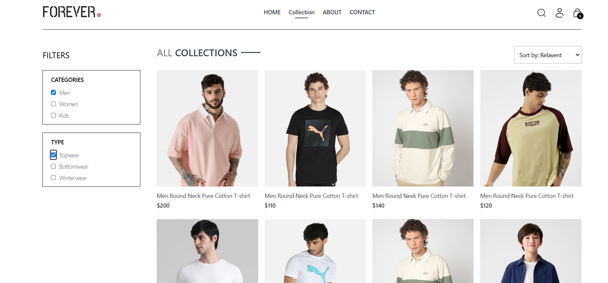

# E-Commerce Store Frontend

This is a feature-rich frontend for an e-commerce store, developed using **React.js**, **Tailwind CSS**, and **HTML**. The project is designed to replicate a modern e-commerce platform with a clean UI and functional components.

## Features

- **Responsive Design**: Fully optimized for desktop, tablet, and mobile views.
- **Dynamic Product Pages**: Product listings, filtering, and sorting functionality.
- **User Authentication**: Includes a login and registration page.
- **Shopping Cart**: Add, view, update, and remove items in the cart.
- **Order Management**: Place and review orders.
- **Search Functionality**: Quickly find products using the search bar.
- **Context API**: State management for shopping cart and user data.
- **Reusable Components**: Modular components for scalability and maintenance.
- **Newsletter Section**: Users can subscribe to updates.

## Folder Structure

```
src/
├── assets/                # Static assets like images
├── components/            # Reusable UI components
│   ├── BestSeller.jsx
│   ├── CartTotal.jsx
│   ├── Footer.jsx
│   ├── Hero.jsx
│   ├── LatestCollection.jsx
│   ├── Navbar.jsx
│   ├── NewsLetterBox.jsx
│   ├── OurPolicy.jsx
│   ├── ProductItem.jsx
│   ├── RelatedProducts.jsx
│   ├── ScrollToTop.jsx
│   ├── SearchBar.jsx
│   └── Title.jsx
├── context/               # Context API for state management
│   └── ShopContext.jsx
├── pages/                 # Main application pages
│   ├── About.jsx
│   ├── Cart.jsx
│   ├── Collection.jsx
│   ├── Contact.jsx
│   ├── Home.jsx
│   ├── Login.jsx
│   ├── Orders.jsx
│   ├── PlaceOrder.jsx
│   └── Product.jsx
├── App.jsx                # Root component
├── index.css              # Global styles
├── main.jsx               # Application entry point
├── index.html             # Main HTML template
├── tailwind.config.js     # Tailwind CSS configuration
├── vite.config.js         # Vite configuration
├── package.json           # Project dependencies and scripts
└── README.md              # Documentation
```

## Technologies Used

- **React.js**: A JavaScript library for building user interfaces.
- **Tailwind CSS**: A utility-first CSS framework for fast UI development.
- **HTML**: Markup language for structuring the application.
- **Vite**: A modern frontend build tool for faster development.

## Installation

1. Clone the repository:

   ```bash
   git clone https://github.com/mubashir72/Ecommerce-Store-React.git
   cd ecommerce-store
   ```

2. Install dependencies:

   ```bash
   bun install
   ```

3. Run the development server:

   ```bash
   bun dev
   ```

4. Open the app in your browser at `http://localhost:5173`.

## Scripts

- **`bun dev`**: Starts the development server.
- **`bun build`**: Builds the app for production.
- **`bun lint`**: Lints the code for errors.

## Future Enhancements

- Add backend integration for real-time data.
- Implement payment gateway for order checkout.
- Introduce user reviews and ratings.
- Enhance the admin panel for managing products.

## Screenshots

### Homepage


### Product Listing


